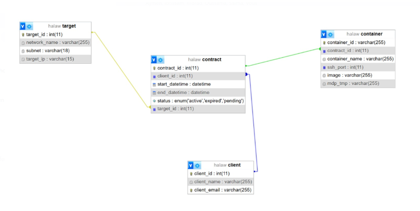

## Table des Matières

- [Contexte](#contexte)
- [Prérequis](#prérequis)
- [Installation et Exécution](#installation-et-exécution)


## Contexte 

Automated "Pentest"

  I'm living in RGPD-free country where laws are cool concerning privacy,  and  the fact you may "borrow" computing resources. I also have some software that turns any contaners I do "control" into a node helping my clients to do some "pentest": DDoS, phishing to name a few. My clients like to ask me for some of those containers I "control" in order to do some "pentest" on their "friends" infrastructure. 

I experience from time to time problems with the containers I control, and I loose them. Fortunately, it happens that I also gain control of new resources from time to time. I  want to have a tool allowing me to offer some quality of service to my client, by providing them, out my resource pool, a (quite) constant number of resources. 

## Prérequis

- [Docker](https://docs.docker.com/get-docker/) (version 20.10 ou supérieure)
- [Ansible](https://docs.ansible.com/ansible/latest/installation_guide/intro_install.html) (version 2.9 ou supérieure)
- Accès à un terminal Linux (Kali Linux recommandé)


## Installation et Exécution 

1. **Cloner le dépôt :**
  ```bash
    git clone https://github.com/IbtissamBighrman/tests-securite-automatises.git
  ```
2. **Dans le répertoire 'admin' exécutez la commande suivante :**
  ```bash
    docker-compose up
  ```
3. **Accédez au conteneur 'admin-container' :**
  ```bash
    docker exec -it admin-container /bin/bash
  ```
4. **Dans le répertoire 'ansible' executez la commande suivante :**
   - *grâce à cette commande vous pouvez générer un nombre N de conteneurs*
  ```bash
    ansible-playbook -i inventory playbook.yml
  ```
5. **Pour créer un conteneur cible et l'associer à un network:**
   - *Dans le répertoire 'cible' :*
  ```bash
    ansible-playbook -i inventory playbook.yml
  ```
   - *Après cette commande un conteneur container_target<id_cible> et un network network_target<id_cible>* 

6. **Lancer le serveur apache qui vous permettra d'accéder à une interface graphique**
  
  ```bash
    service apache2 start
  ```
   - *Vous pouvez maintenant créer des contrats dans l'interface admin (http://localhost:8081)*
7. **Dans le répertoire 'ancible' :**
  ```bash
    ./nouveau_contrat.sh <id_contract>
  ```
   - Ce script permet de :
     - Connecter les conteneurs attaquants au réseau de la cible.

     - Envoyer un mail de confirmation au client (avec les identifiants ssh)

     - Transférer un script d'attque vers les conteneurs attaquant et lancer l'attaque ( cette étape est optionnelle : le client peut se connecter en ssh et créer son propre script d'attque )

## Architecture ##


## Informations utiles ##
1. **BDD :**


   1.1.1 *Pour accéder à la BDD:*
  ```bash
    docker exec -it mysql-container mysql -u root -p
  ```

   1.1.2 *mdp:*
  ```bash
    rootpassword
  ```

  1.2 *Commandes utiles:*
  ```bash
    USE containers_db;
  ```

  ```bash
    SHOW TABLES;
  ```
2. **Les Tâches planifiées**
   - verifier_contrats_expires.sh
   - conteneur_endommages.sh
